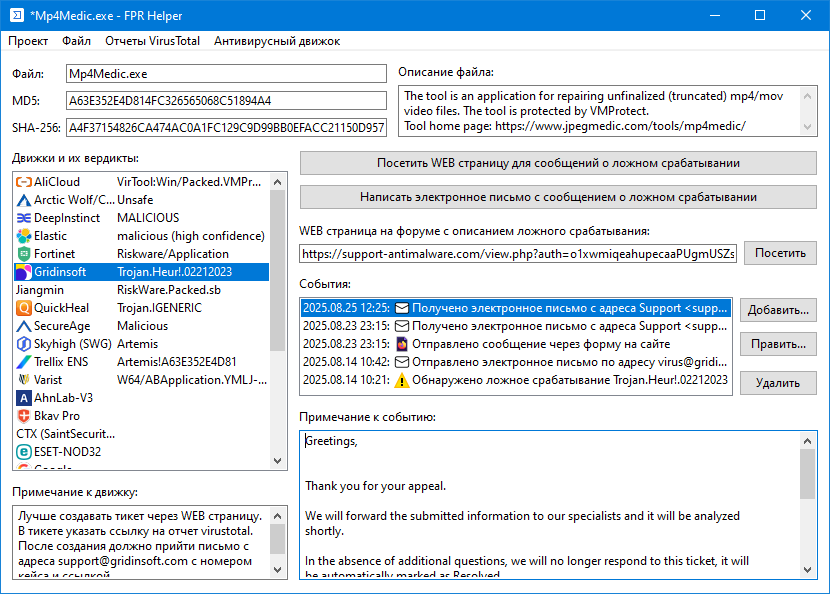

# FPR Helper

FPR Helper - это приложение записная книжка, немного упрощающая взаимодействие с антивирусными компаниями.

Основные возможности:

- Взаимодействие с сайтом virustotal.com (загрузка файлов на сайт для анализа, загрузка результатов сканирования).
- Готовая база данных контактов антивирусных компаний.
- Формирования писем (при необходимости с вложением) и отправка их через Simple MAPI.
- Возможность сохранять историю взаимодействия с антивирусными компаниями по каждому случаю ложного срабатывания.
